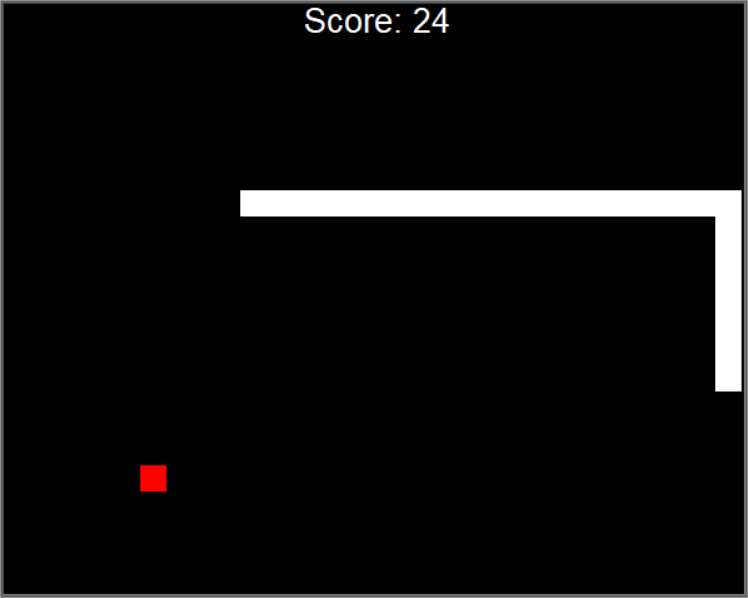
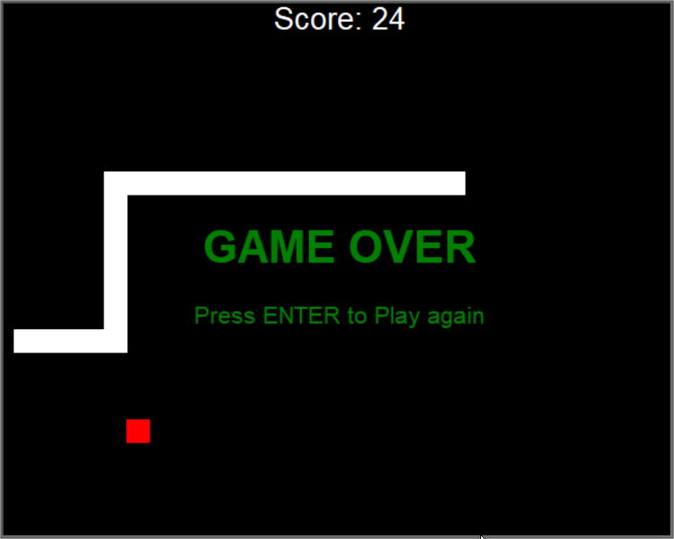

# Snake Game (Python Turtle Graphics)

## Description

This is a basic implementation of the Classic Snake Game from the old Nokia mobile phones.

The app was writen using Python, with object orientated programming in mind

Note if you find commented-out print Statements that I did not remove it means I was simply testing something there and did not remove it.

## How to Use/Run

This was written using Python 3.10.4 so it should run fine with Python 3.10 installed on your machine.

### Basic controlls are
Up arrow, Down arrow, Right arrow, Left arrow - Move your snake

Enter/Return - Restarts the game

### Game Features

- Progressive difficulty, You can easily change this in the main.py file
- Random Colored food that the snake must chase
- Wall and Self Collision detection
- Restart the game when Game Over by hitting Enter/Return
- Keeps your score at the top of the screen

### Files Included

Scoreboard.py

- Handles most of the onscreen function

Snake.py

- Implements the snake

Food.py

- Implements Food and spawns in random location

Main.py

- Main Game loop and Event listeners
